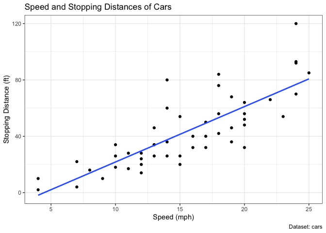

# Class 5 Lab
Maddie Maslyar (PID A69042845)

``` r
#install.packages("ggplot2")
library(ggplot2)

#Dot plot of cars mapping distance versus speed
ggplot(cars, aes(x = speed, y = dist)) +
  geom_point() 
```


``` r
#Dot plot and linear model of cars mapping distance versus speed

ggplot(cars, aes(x = speed, y = dist)) +
  geom_point() +
  
#Linear model
  geom_smooth(method = "lm", se = FALSE) +

#Label
  labs(title = "Speed and Stopping Distances of Cars",
       x = "Speed (mph)",
       y = "Stopping Distance (ft)",
       caption = "Dataset: cars") +
  theme_bw()
```

    `geom_smooth()` using formula = 'y ~ x'



``` r
# Gene expression profile of anti-viral drug treatment
url <- "https://bioboot.github.io/bimm143_S20/class-material/up_down_expression.txt"
genes <- read.delim(url)
head(genes)
```

            Gene Condition1 Condition2      State
    1      A4GNT -3.6808610 -3.4401355 unchanging
    2       AAAS  4.5479580  4.3864126 unchanging
    3      AASDH  3.7190695  3.4787276 unchanging
    4       AATF  5.0784720  5.0151916 unchanging
    5       AATK  0.4711421  0.5598642 unchanging
    6 AB015752.4 -3.6808610 -3.5921390 unchanging

``` r
#Plotting gene expression increase (red) and decrease (blue) of anti-viral drug treatment
ggplot(genes, aes(x = Condition1, y = Condition2, color = State)) +
  geom_point() +
  scale_color_manual(values = c("blue", "gray", "red")) +
  labs(title = "Gene Expression Changes Upon Drug Treatment",
       x = "Control (no drug)",
       y = "Drug Treatment")
```


