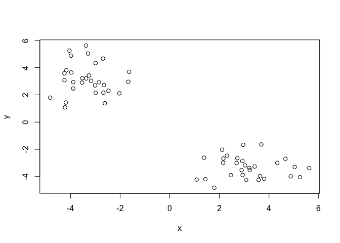
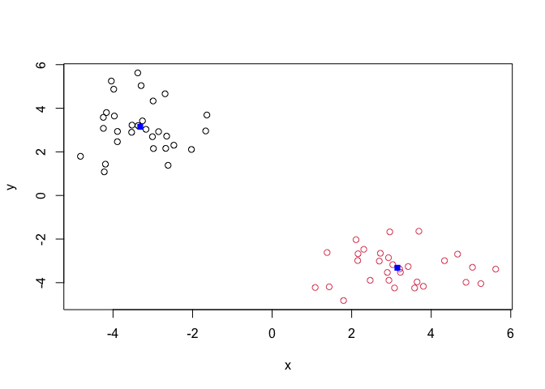
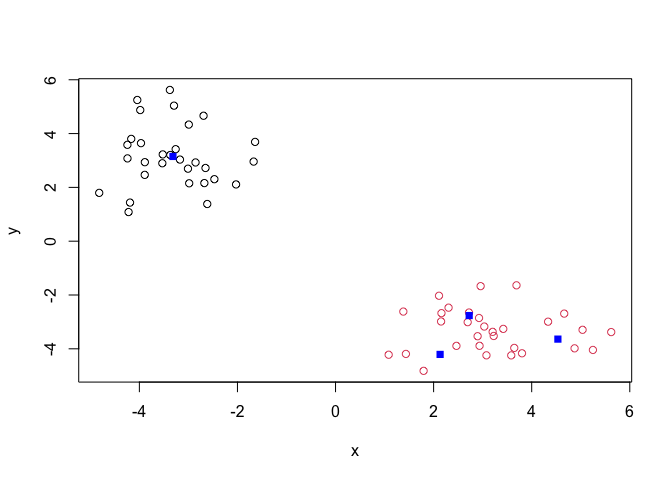
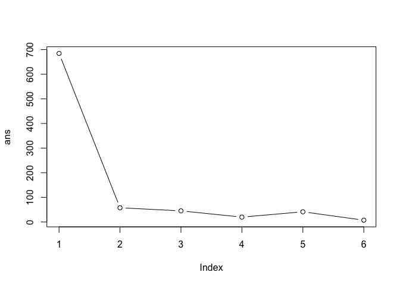
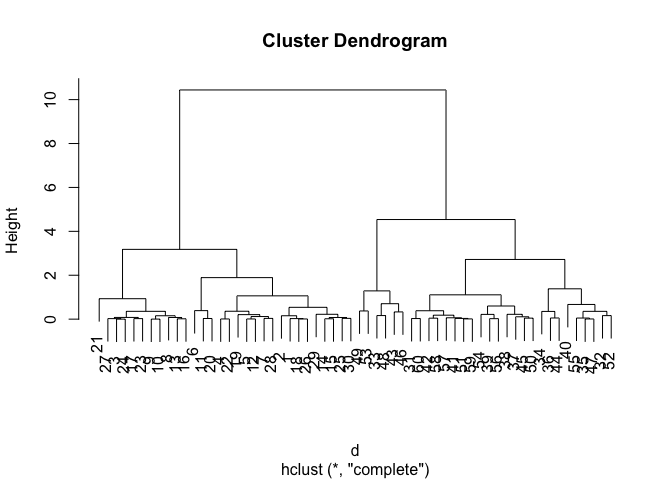
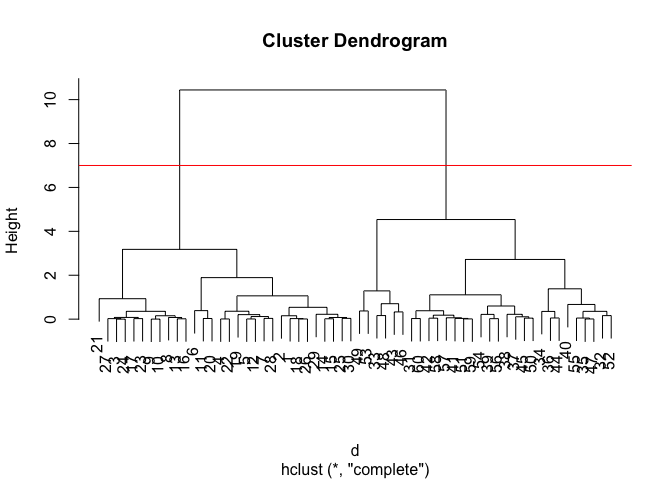
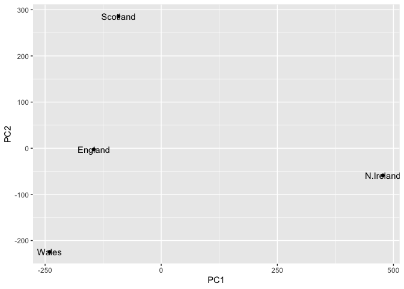
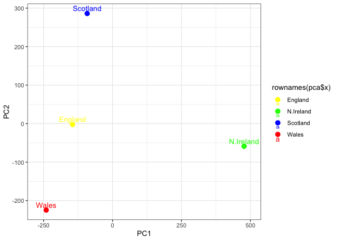

# Class 7: Machine Learning 1
Maddie Maslyar (PID: A69042845)

``` r
x <- c(rnorm(30, mean = -3), rnorm(30, mean = 3))
y <- rev(x)
z <- cbind(x, y)
```

``` r
plot(z)
```



The main function in “base” R for K-menas clustering is called
‘kmeans()’

``` r
k <- kmeans(z, centers = 2, nstart = 20)
k
```

    K-means clustering with 2 clusters of sizes 30, 30

    Cluster means:
              x         y
    1 -3.315527  3.149346
    2  3.149346 -3.315527

    Clustering vector:
     [1] 1 1 1 1 1 1 1 1 1 1 1 1 1 1 1 1 1 1 1 1 1 1 1 1 1 1 1 1 1 1 2 2 2 2 2 2 2 2
    [39] 2 2 2 2 2 2 2 2 2 2 2 2 2 2 2 2 2 2 2 2 2 2

    Within cluster sum of squares by cluster:
    [1] 57.58444 57.58444
     (between_SS / total_SS =  91.6 %)

    Available components:

    [1] "cluster"      "centers"      "totss"        "withinss"     "tot.withinss"
    [6] "betweenss"    "size"         "iter"         "ifault"      

Q. How big are the clusters?

``` r
k$size
```

    [1] 30 30

What clusters to my data reside within?

``` r
k$cluster
```

     [1] 1 1 1 1 1 1 1 1 1 1 1 1 1 1 1 1 1 1 1 1 1 1 1 1 1 1 1 1 1 1 2 2 2 2 2 2 2 2
    [39] 2 2 2 2 2 2 2 2 2 2 2 2 2 2 2 2 2 2 2 2 2 2

Make a plot of our data colored by cluster assignment:

``` r
plot(z, col = k$cluster) 
points(k$centers, col = "blue", pch = 15)
```



Q. Cluster with k-means into 4 clusters and plot the results.

``` r
k4 <- kmeans(z, centers = 4)
plot(z, col = k$cluster) 
points(k4$centers, col = "blue", pch = 15)
```



Q. Run kmeans with centers (calues of k) equal 1 to 6.

``` r
k$tot.withinss
```

    [1] 115.1689

``` r
k1 <- kmeans(x, centers = 1)$tot.withinss
k2 <- kmeans(x, centers = 2)$tot.withinss
k3 <- kmeans(x, centers = 3)$tot.withinss
k4 <- kmeans(x, centers = 4)$tot.withinss
k5 <- kmeans(x, centers = 5)$tot.withinss
k6 <- kmeans(x, centers = 6)$tot.withinss

ans <- c(k1, k2, k3, k4, k5, k6)
```

Using a loop:

``` r
ans <- NULL 
for(i in 1:6) {
  ans <- c(ans, kmeans(x, centers = i)$tot.withinss)
}
ans
```

    [1] 684.503286  57.584435  45.056232  19.691081  41.293521   7.194545

Make a “scree-plot”

``` r
plot(ans, typ = "b")
```



## Hierarchical Clustering

The main function in “base” R for this is called ‘hclust()’

``` r
d <- dist(x)
hc <- hclust(d)
hc
```


    Call:
    hclust(d = d)

    Cluster method   : complete 
    Distance         : euclidean 
    Number of objects: 60 

``` r
plot(hc)
```



``` r
plot(hc)
abline(h = 7, col = "red")
```



``` r
library(pheatmap)
```

Class 7 Lab Input information

``` r
url <- "https://tinyurl.com/UK-foods"
x <- read.csv(url)
```

Q1. How many rows and columns are in your new data frame named x? What R
functions could you use to answer this questions?

``` r
dim(x)
```

    [1] 17  5

``` r
head(x)
```

                   X England Wales Scotland N.Ireland
    1         Cheese     105   103      103        66
    2  Carcass_meat      245   227      242       267
    3    Other_meat      685   803      750       586
    4           Fish     147   160      122        93
    5 Fats_and_oils      193   235      184       209
    6         Sugars     156   175      147       139

``` r
#Set row names to first column of data frame

x <- read.csv(url, row.names = 1)
head(x)
```

                   England Wales Scotland N.Ireland
    Cheese             105   103      103        66
    Carcass_meat       245   227      242       267
    Other_meat         685   803      750       586
    Fish               147   160      122        93
    Fats_and_oils      193   235      184       209
    Sugars             156   175      147       139

``` r
dim(x)
```

    [1] 17  4

A1. There are 17 rows and four columns, as identified by using dim().

Q2. Which approach to solving the ‘row-names problem’ mentioned above do
you prefer and why? Is one approach more robust than another under
certain circumstances?

A2. Setting the row names equal to 1 prevents the code block from
amputating a column from our data table every time the code is run (as
was the case for x \< - x\[,-1\])

``` r
barplot(as.matrix(x), beside=T, col=rainbow(nrow(x)))
```


Q3: Changing what optional argument in the above barplot() function
results in the following plot?

A3. Setting beside = FALSE stacks the column values on top of each
other.

Q4: Changing what optional argument in the above ggplot() code results
in a stacked barplot figure?

A4. geom_col creates a stacked bar chart.

## Pairs plots and heatmaps

Scatterplot matricies (“pairs plots”) can be useful for small datasets.

Q5: We can use the pairs() function to generate all pairwise plots for
our countries. Can you make sense of the following code and resulting
figure? What does it mean if a given point lies on the diagonal for a
given plot?

``` r
pairs(x, col=rainbow(nrow(x)), pch=16)
```


A5. Each point indicates a food that is mapped based on consumption in
one country versus another. A point lying along the horizontal line
indicates equal consumption in the compared countries.

Q6. Based on the pairs and heatmap figures, which countries cluster
together and what does this suggest about their food consumption
patterns? Can you easily tell what the main differences between N.
Ireland and the other countries of the UK in terms of this data-set?

``` r
library(pheatmap)

pheatmap( as.matrix(x) )
```


A6. Scottland, England, and Wales cluster, indicating similar food
consumption. Northern Ireland has the most distinct clustering. Potatoes
and alcoholic drinks appear to be two major differences.

## PCA to the rescue

The main function in “base” R for PCA is called ‘prcomp()’.

As we want to do PCA on the food data for the different countries we
will want the foods in the columns.

``` r
pca <- prcomp(t(x))
summary(pca)
```

    Importance of components:
                                PC1      PC2      PC3       PC4
    Standard deviation     324.1502 212.7478 73.87622 2.921e-14
    Proportion of Variance   0.6744   0.2905  0.03503 0.000e+00
    Cumulative Proportion    0.6744   0.9650  1.00000 1.000e+00

Our result object is called ‘pca’and it has a’\$’ component that we will
look at first.

``` r
library(ggplot2)
ggplot(pca$x) +
  aes(PC1, PC2, label = rownames(pca$x)) +
  geom_point() +
  geom_text()
```



Another major result out of PCA is the so-called “variable loadings” or
`$rotation` that tells us how the original variables (foods) contribute
to PCs (i.e. our new axis).

``` r
ggplot(pca$rotation) +
  aes(PC1, rownames(pca$rotation)) +
  geom_col()
```


Q7. Complete the code below to generate a plot of PC1 vs PC2. The second
line adds text labels over the data points.

A7.

``` r
# Create a data frame for plotting
df <- as.data.frame(pca$x)
df$Country <- rownames(df)

# Plot PC1 vs PC2 with ggplot
ggplot(pca$x) +
  aes(x = df$PC1, y = df$PC2, label = rownames(pca$x)) +
  geom_point(size = 3) +
  geom_text(vjust = -0.5) +
  xlim(-270, 500) +
  xlab("PC1") +
  ylab("PC2") +
  theme_bw()
```


Q8. Customize your plot so that the colors of the country names match
the colors in our UK and Ireland map and table at start of this
document.

A8.

``` r
ggplot(pca$x, aes(x = df$PC1, y = df$PC2, label = rownames(pca$x), color = rownames(pca$x))) +
  geom_point(size = 3) +
  geom_text(vjust = -0.5) +
  xlim(-270, 500) +
  xlab("PC1") +
  ylab("PC2") +
  theme_bw() + 
  scale_color_manual(values = c("yellow", "green", "blue", "red"))
```


